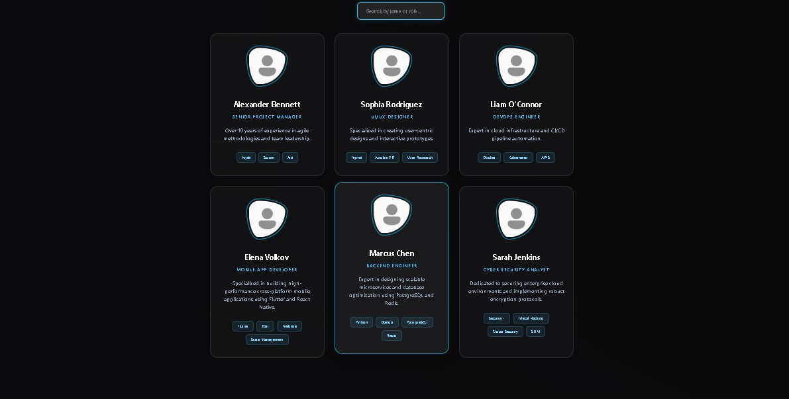
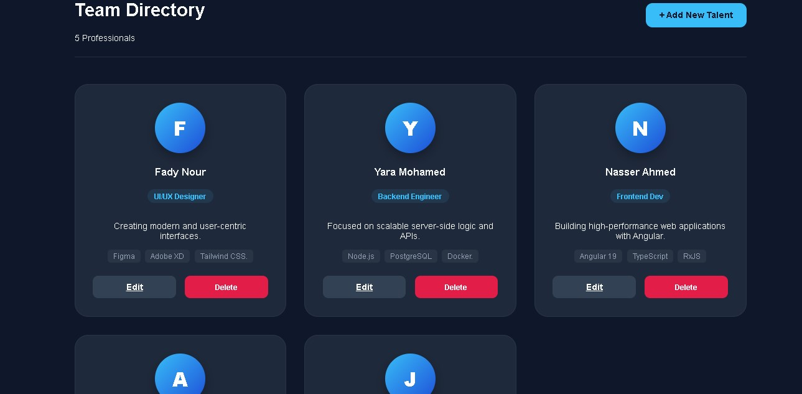

# NTI-Freelance-Tasks

This repository contains a collection of micro-projects developed during the NTI Freelance training. Each project is organized in its own directory using a Clean Architecture approach.

---

##  Table of Contents
1. [User Profile Viewer](#1-user-profile-viewer)
2. [Static Content Display](#2-static-content-display)
3. [Product Listing (Full CRUD)](#3-product-listing)

---

## 1. User Profile Viewer
**Client:** Codezilla SRL  
**Tech Stack:** Angular 21, Node.js, Express, MongoDB.
- **Description:** A simple app to fetch and display hardcoded user profiles from a database.
- **Folder:** `/User-Profile-Viewer`

###  Preview

---

## 2. Static Content Display
**Client:** Tuio  
**Tech Stack:** Angular 21, Express.js.
- **Description:** Serving static HTML/CSS content using an Express server without a database.
- **Folder:** `/static-content-app`

###  Preview

---

## 3. Product Listing (Full CRUD)
**Client:** Hariga  
**Tech Stack:** MEAN Stack (MongoDB Atlas, Express, Angular 21, Node.js).
- **Description:** A production-ready Full-Stack application for managing product listings with full CRUD operations.
- **Folder:** `/Product%20Listing`

###  Preview

---

##  General Instructions
To run any of the projects:
1. Navigate to the specific folder: `cd folder-name`
2. Install dependencies: `npm install`
3. Start the application:
   - For Backend: `node server.js` or `npm run dev`
   - For Frontend: `npm start`